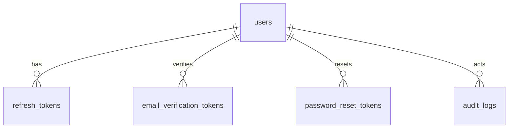
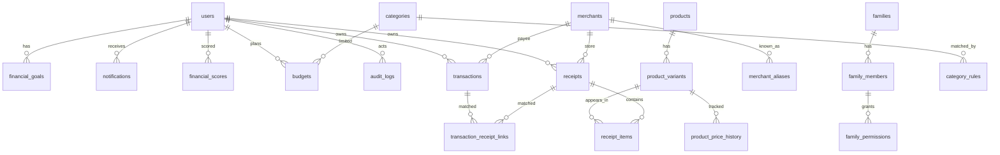

# Berrio — ERD v1.3

Logical schema. Auth tables implemented in Stage 2 (`0002_auth`).

## Core identity (Stage 2 — implemented)

```text
users
  id UUID PK
  email_enc BYTEA              -- Fernet ciphertext
  email_hash VARCHAR UNIQUE    -- sha256(pepper + email)
  password_hash VARCHAR        -- Argon2id
  display_name VARCHAR
  is_active BOOL
  email_verified_at TIMESTAMPTZ NULL
  created_at, updated_at TIMESTAMPTZ

refresh_tokens
  id UUID PK
  user_id FK → users ON DELETE CASCADE
  token_hash VARCHAR UNIQUE    -- HMAC-SHA256 of opaque token
  device_id VARCHAR            -- stable client device id
  device_name VARCHAR NULL
  user_agent VARCHAR NULL
  ip_hash VARCHAR NULL
  expires_at TIMESTAMPTZ
  revoked_at TIMESTAMPTZ NULL
  replaced_by_id UUID NULL     -- rotation chain
  created_at TIMESTAMPTZ

email_verification_tokens      -- architectural prep
  id, user_id FK, token_hash UNIQUE, expires_at, used_at, created_at

password_reset_tokens          -- architectural prep
  id, user_id FK, token_hash UNIQUE, expires_at, used_at, created_at

audit_logs                     -- append-only
  id UUID PK
  actor_user_id FK → users ON DELETE SET NULL
  action VARCHAR               -- auth.login, auth.refresh, ...
  entity_type VARCHAR NULL
  entity_id UUID NULL
  family_id UUID NULL
  ip_hash VARCHAR NULL
  metadata_json TEXT NULL
  created_at TIMESTAMPTZ
```



## Family + permissions

```text
families
  id, name, owner_user_id FK, created_at

family_members
  id, family_id FK, user_id FK
  role ENUM(OWNER, PARENT, CHILD)
  UNIQUE(family_id, user_id)

family_permissions
  id, family_id FK, member_id FK
  permission_key VARCHAR   -- e.g. can_view_family_budget
  allowed BOOL
  UNIQUE(family_id, member_id, permission_key)
```

## Categories + categorization

```text
categories
  id, parent_id FK NULL, slug, name
  system_default BOOL
  owner_user_id NULL, family_id NULL

category_rules
  id, user_id FK NULL          -- NULL = system rule
  pattern VARCHAR
  match_type VARCHAR           -- exact|contains|regex
  category_id FK
  merchant_id FK NULL
  priority INT
```

Categorization **engine** uses `category_rules` + AI; no separate persistence beyond rules/results on items/txs.

## Merchants (normalization)

```text
merchants
  id UUID PK
  canonical_name VARCHAR
  category_id FK NULL
  inn VARCHAR NULL
  created_at

merchant_aliases
  id UUID PK
  merchant_id FK
  alias_raw VARCHAR
  alias_normalized VARCHAR     -- lowercased, stripped
  source VARCHAR               -- bank|receipt|manual
  UNIQUE(alias_normalized)
```

## Products + variants

```text
products
  id, brand, name, category_id FK NULL

product_variants
  id, product_id FK
  barcode VARCHAR NULL UNIQUE
  weight NUMERIC NULL
  volume NUMERIC NULL
  unit VARCHAR                 -- ml|g|kg|l|pcs
  UNIQUE(product_id, weight, volume, unit)

product_price_history
  id, product_variant_id FK
  store_name / merchant_id
  price, quantity, unit
  purchased_at, receipt_item_id FK, user_id FK
```

## Receipts & transactions

```text
receipts
  id, user_id, family_id NULL
  fn, fd, fp, purchased_at, total_amount
  store_name, merchant_id FK NULL, store_inn
  status, raw_payload_enc
  UNIQUE(user_id, fn, fd, fp)

receipt_items
  id, receipt_id FK
  product_variant_id FK NULL
  name_raw, qty, price, sum
  category_id FK NULL

transactions
  id, user_id, family_id NULL
  source ENUM(BANK, MANUAL, RECEIPT)
  amount, currency, merchant_raw, merchant_id FK NULL
  booked_at, category_id, bank_connection_id NULL
  external_id, status

transaction_receipt_links
  id, transaction_id FK, receipt_id FK
  match_status ENUM(SUGGESTED, CONFIRMED, REJECTED, CONFLICT)
  amount_diff
  UNIQUE(transaction_id, receipt_id)

bank_connections
  id, user_id, bank_code, email_enc, imap_meta_enc
  status, last_synced_at
```

## Budgets

```text
budgets
  id UUID PK
  user_id FK
  family_id FK NULL
  name VARCHAR
  category_id FK NULL          -- NULL = overall budget
  limit_amount NUMERIC(14,2)
  currency CHAR(3) DEFAULT 'RUB'
  period_type ENUM(WEEK, MONTH, YEAR, CUSTOM)
  period_start DATE
  period_end DATE NULL
  status ENUM(ACTIVE, ARCHIVED)
  created_at

budget_spend_snapshots       -- optional cache for analytics
  id, budget_id FK, as_of, spent_amount
```

## Goals, notifications, health

```text
financial_goals
  id, user_id, family_id NULL
  name, target_amount, current_amount
  deadline, category, status, created_at

notifications
  id, user_id
  type ENUM(PRICE_CHANGE, BUDGET_WARNING, AI_INSIGHT, GOAL_PROGRESS, SYSTEM)
  title, message, is_read, payload JSONB NULL
  created_at

financial_scores
  id, user_id
  score INT                    -- 0..100
  period_start, period_end
  factors JSONB                -- {positive:[], negative:[]}
  created_at

ai_insights
  id, user_id, family_id NULL
  period_start, period_end, type, payload_enc, created_at
```

## Audit

Implemented in Stage 2 — see **Core identity** (`audit_logs`, append-only, `metadata_json`).

## Client-only (Drift)

```text
sync_queue
  id, type, payload JSON
  status ENUM(PENDING, SYNCING, DONE, FAILED)
  created_at, retry_count
  last_error NULL
  idempotency_key
```

Not replicated to PostgreSQL.

## Mermaid (core)


